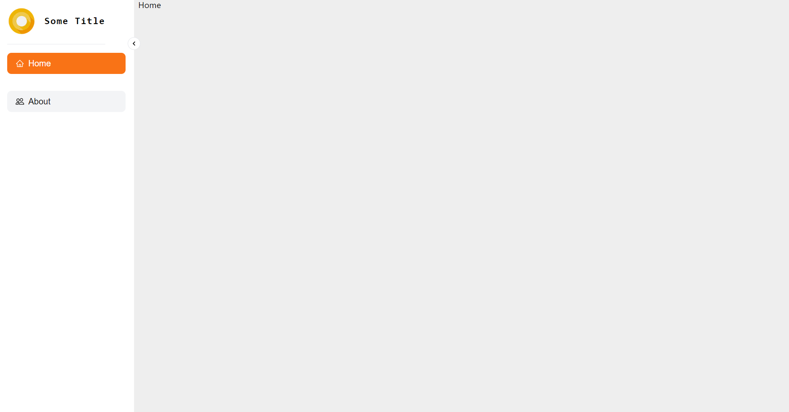
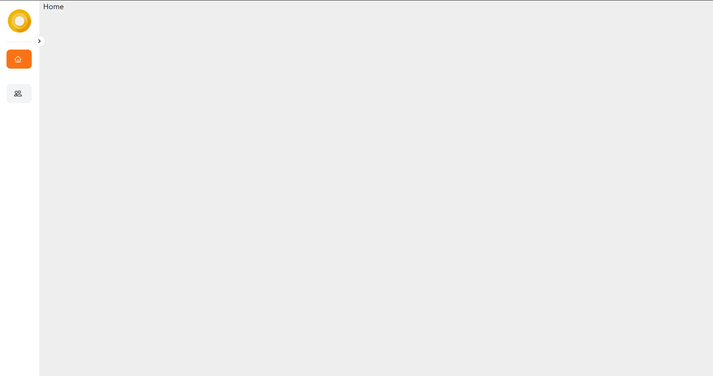

# Next.js Animated Sidebar Template

This is a template for creating an animated sidebar component in Next.js.

## Features

- Smooth animation for opening and closing the sidebar
- Customizable styles and appearance
- Responsive design for various screen sizes

## Screenshots



*Caption: The sidebar in the open state, revealing navigation links.*



*Caption: The sidebar in the closed state, taking up minimal space.*

## Usage

1. **Clone the Repository:**

    ```bash
    git clone https://github.com/OussamaOub/animated-siderbar-template.git
    ```

2. **Install Dependencies:**

    ```bash
    npm install
    ```

3. **Run the Development Server:**

    ```bash
    npm run dev
    ```

4. **Customize the Sidebar:**

    - Edit the `Sidebar` component in `components/SideBar.tsx`.
    - Edit the `Sidebar Context` component in `components/SideBarContext.tsx`.
    - Adjust styles, add icons, and modify links to suit your project.
---

Feel free to adapt this template to your specific needs, adding or removing sections as necessary. Make sure to replace placeholder content with your actual repository information, screenshots, and relevant links.
